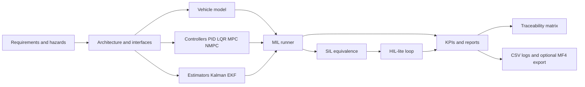

# V-Model Validation Pipeline for Optimization-Based Control Algorithms

This repository is an industry-inspired validation framework for optimization-based control
algorithms. The primary case study is CommonRoad-style road-motion control, using a reusable
workflow that connects requirements, controller code, tests, logs, reports, and traceability.

The project is intentionally structured as a miniature engineering program rather than a single
controller demo:

```text
Requirements -> modeling -> PID/LQR/Kalman baselines -> MPC/NMPC
-> MIL -> SIL -> HIL-lite -> logging -> traceability -> reports
```

## Why This Project Exists

Control validation requires more than demonstrating that a controller works once. The goal here is
to show that a control algorithm can be packaged, tested, compared against baselines, monitored for
timing and fallback behavior, and explained through reproducible artifacts.

This project currently demonstrates that workflow for a road-motion control problem. The
CityLearn/OpenDSS energy-management case study is intentionally deferred until the CommonRoad path
is stronger.

## Architecture



Important boundaries:

| Area | Location | Purpose |
|---|---|---|
| Requirements and hazards | `docs/requirements/`, `docs/hazards/` | V-model-inspired engineering thread |
| Benchmark adapter | `src/vcp/benchmarks/` | CommonRoad manifest and scenario loading |
| Plant model | `src/vcp/models/` | Kinematic bicycle state, input, integration, constraints |
| Controllers | `src/vcp/controllers/` | PID, LQR, linear MPC, CasADi NMPC, fallback brake |
| Estimators | `src/vcp/estimators/` | Linear Kalman filter and EKF |
| Validation | `src/vcp/validation/` | MIL runner, SIL equivalence, KPIs, safety supervisor |
| HIL-lite | `src/vcp/hil/` | UDP-style protocol, controller server, timing loop |
| Logging and CAN | `src/vcp/logging/` | Signal dictionary, CSV logs, optional MF4, calibration, virtual CAN |

## Toolchain

Core stack:

| Layer | Tools |
|---|---|
| Language | Python 3.11 |
| Models and numerics | NumPy, SciPy-compatible patterns |
| Classical control | PID, LQR |
| Estimation | Kalman filter, EKF |
| Optimization control | CVXPY/OSQP linear MPC, CasADi/IPOPT NMPC |
| Testing | pytest, Ruff, coverage-ready layout |
| Reproducibility | Docker, GitHub Actions, config files |
| Evidence | JSON, CSV, Markdown, SVG plots, optional ASAM MDF/MF4 export |

Optional logging dependencies:

```bash
pip install -e ".[logging]"
```

MF4 export is supported when `asammdf` is installed. CSV remains the default so the project stays
portable in CI and local development.

Optional CommonRoad drivability dependencies:

```bash
pip install -e ".[commonroad,commonroad-drivability]"
```

The project uses these optional packages only when real CommonRoad XML scenarios and the
CommonRoad-DC tooling are available.

The CommonRoad-DC path currently pins `commonroad-io<2026` because
`commonroad-drivability-checker 2025.4.0` expects module paths that changed in `commonroad-io
2026.1`.

## Algorithms Implemented

| Algorithm | Status | Role |
|---|---|---|
| PID | Implemented | Simple speed and steering baseline |
| LQR | Implemented | Classical state-space lateral-control baseline |
| Kalman filter | Implemented | Linear estimator baseline |
| EKF | Implemented | Nonlinear vehicle-state estimation |
| Linear MPC | Implemented | First constrained optimization controller |
| CasADi NMPC | Implemented | Nonlinear optimization controller for tracking |
| Safety supervisor | Implemented | Fallback decisions for solver, timing, estimator, command, and communication faults |

## Validation Workflow

| Stage | Current evidence |
|---|---|
| Requirements | YAML requirements, hazard log, traceability matrix |
| MIL | Controller comparison on synthetic smoke references derived from the CommonRoad manifest |
| SIL | Back-to-back equivalence through stable controller adapters |
| HIL-lite | In-process/UDP-style loop with latency, timeout, missed-deadline, and fallback logging |
| CommonRoad checks | Lanelet membership, kinematic checks, and optional CommonRoad-DC collision/boundary checks |
| Logging | Signal dictionary, CSV logs, JSON metadata, optional MF4 export hook, virtual CAN frames |

The wording is deliberate: this is **V-model-inspired**, **ISO 26262-inspired**, and
**HIL-lite**. It is not a certified safety project and does not claim full dSPACE/Speedgoat HIL.

## Results Snapshot

Fresh Phase 14 smoke run:

```bash
python -m vcp.validation.run_mil \
  --suite configs/commonroad/scenario_suite.yaml \
  --controller all \
  --max-scenarios 0 \
  --steps 120 \
  --output-dir artifacts/phase14_mil_all
```

These results use synthetic tracking references when raw CommonRoad XML files are not present.

| Controller | Success rate | Collision count | Mean lateral RMSE | Mean speed RMSE | Max p95 solve time | Fallback count |
|---|---:|---:|---:|---:|---:|---:|
| PID | 0.80 | 0 | 0.3211 m | 0.9891 m/s | 0.02 ms | 0 |
| LQR | 0.80 | 0 | 0.3177 m | 0.9845 m/s | 0.01 ms | 0 |
| Linear MPC | 0.80 | 0 | 0.3027 m | 0.9623 m/s | 62.73 ms | 0 |
| NMPC | 1.00 | 0 | 0.2285 m | 0.9601 m/s | 2.66 ms | 0 |

Interpretation: NMPC currently performs best on the harder synthetic tracking cases, especially
turn-like and lane-change references. This is not yet proof of obstacle avoidance, because full
CommonRoad collision/drivability checking is still future work.

## How To Run

Create or activate the project-local conda environment:

```bash
conda env create --prefix ./.conda -f environment.yml
conda activate ./.conda
```

Run tests and lint:

```bash
pytest
ruff check src tests scripts
```

Build the container:

```bash
docker build -t vcp .
```

Run a quick MIL benchmark:

```bash
python -m vcp.validation.run_mil \
  --suite configs/commonroad/scenario_suite.yaml \
  --controller nmpc
```

Replay a signal log:

```bash
python scripts/replay_signal_log.py artifacts/example/controller_signals.csv
```

## CommonRoad Data

The repository does not vendor raw CommonRoad benchmark XML files. Place downloaded scenarios here:

```text
data/raw/commonroad/scenarios/
```

If raw XML files are missing, the MIL runner falls back to synthetic smoke scenarios derived from
the manifest and labels the results accordingly. That keeps CI lightweight while avoiding false
claims about full benchmark coverage.

For a real local scenario set, fetch the seven-scenario public suite:

```bash
python scripts/fetch_commonroad_scenarios.py \
  --suite configs/commonroad/real_scenario_suite.yaml
```

Check local readiness:

```bash
python scripts/check_commonroad_scenarios.py \
  --suite configs/commonroad/real_scenario_suite.yaml
```

When real XML files are available, the MIL runner annotates each row with CommonRoad-specific
validation evidence:

| Field | Meaning |
|---|---|
| `commonroad_lanelet_checked` | Lanelet-network membership check was available |
| `commonroad_dc_checked` | CommonRoad-DC collision or boundary checker was available |
| `commonroad_kinematic_violation` | Vehicle state or applied command violated configured limits |
| `commonroad_check_notes` | Notes explaining skipped optional checks or checker failures |

## Virtual CAN

The project includes a small virtual CAN interface for replaying controller signal logs into
deterministic CAN-style frames:

```text
configs/hardware/virtual_can.yaml
configs/hardware/vcp_controller.dbc
```

Replay a CSV signal log to JSONL CAN frames:

```bash
python scripts/replay_signal_log_to_virtual_can.py \
  artifacts/example/controller_signals.csv \
  --output artifacts/virtual_can/controller_status_frames.jsonl
```

This is a local interface test, not real vehicle-bus validation. `cantools` and `python-can` are
optional and only needed for DBC parsing or conversion to `python-can` messages.

## Main Reports

- [Final report](docs/reports/final_report.md)
- [MIL report](docs/reports/mil_report.md)
- [SIL report](docs/reports/sil_report.md)
- [HIL-lite report](docs/reports/hil_lite_report.md)
- [CommonRoad drivability report](docs/reports/commonroad_drivability_report.md)
- [System architecture](docs/architecture/system_architecture.md)
- [Traceability matrix](docs/requirements/traceability_matrix.csv)
- [Validation plan](docs/reports/validation_plan.md)

## Limitations

- Current MIL results are smoke validation unless real CommonRoad XML files are downloaded locally.
- CommonRoad-DC collision and boundary checks are integrated as optional hooks, but the repository
  does not vendor scenario files or claim complete CommonRoad benchmark coverage.
- The NMPC backend currently uses CasADi/IPOPT locally; native acados C code generation is a future
  integration point.
- SIL currently validates stable controller interfaces and Python back-to-back equivalence; compiled
  generated-code execution is optional and not yet wired.
- HIL-lite validates timing and communication behavior on a local machine; it is not full dSPACE,
  Speedgoat, ECU, or CANape/INCA validation.
- The secondary CityLearn/OpenDSS case study has not started yet.

## Future Work

- Integrate real CommonRoad XML scenarios into full closed-loop path and obstacle validation.
- Add CommonRoad drivability-checker collision, feasibility, and road-compliance assessments.
- Generate or package an acados C controller for stronger SIL evidence.
- Extend virtual CAN into SocketCAN `vcan0` replay with `python-can`.
- Add the CityLearn/OpenDSS energy-management transfer case after the road-motion workflow is
  stronger.
