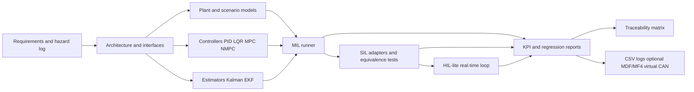
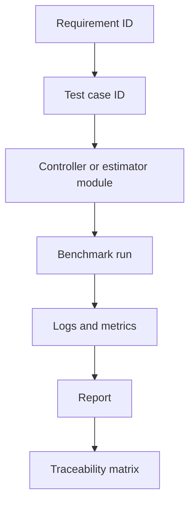

# System Architecture

## Overview

The project is a reusable validation pipeline for optimization-based control algorithms. The first
domain adapter is CommonRoad NMPC motion control. Later, the same validation structure can support
CityLearn and OpenDSS energy-management experiments.

The architecture separates framework code from domain-specific adapters so the validation workflow
can remain stable as controllers, estimators, and plant models change.

## V-Model-Inspired Flow



## Package Boundaries

| Package Area | Responsibility |
| --- | --- |
| `vcp.benchmarks` | Scenario ingestion, manifests, CommonRoad lanelet/drivability adapters |
| `vcp.models` | Domain-independent plant models, states, inputs, and constraints |
| `vcp.controllers` | PID, LQR, MPC, NMPC, and fallback controllers |
| `vcp.estimators` | Kalman, EKF, residual metrics, and estimator diagnostics |
| `vcp.validation` | MIL/SIL/HIL-lite runners, KPIs, interfaces, and safety supervision |
| `vcp.logging` | Signal dictionaries, CSV logs, optional MDF/MF4 export, calibration files, virtual CAN, and run metadata |
| `vcp.utils` | Shared configuration and filesystem helpers |

## Controller Validation Interfaces

Controllers should converge on a stable interface before SIL and HIL-lite:

```text
initialize(config, scenario_context) -> diagnostics
step(measured_or_estimated_state, reference, timestamp) -> command, diagnostics
reset() -> diagnostics
get_diagnostics() -> diagnostics
```

The intent is to reuse the same named test cases across MIL, SIL, and HIL-lite. A PID controller,
an NMPC controller, and a packaged controller adapter should all be callable by the validation
runner through the same shape.

## Safety Supervisor Boundary

The safety supervisor is not a certified safety system. It is an ISO 26262-inspired engineering
mechanism that centralizes validation-time decisions around fallback behavior.

The supervisor will evaluate:

| Input | Example Decision |
| --- | --- |
| Solver status | Switch to fallback if infeasible or invalid |
| Solve time | Switch to timeout mode if above sample-time budget |
| Estimator residual | Switch to estimator-fault mode if above threshold |
| Command limits | Reject invalid commands and request fallback |
| Communication status | Trigger HIL-lite timeout fallback |
| Collision-risk flag | Request emergency stop or fallback brake |

## Data And Evidence Flow



Each run should preserve enough metadata to reproduce the result: git commit, scenario ID,
controller configuration, sample time, random seed, software version, and artifact paths.

## Initial Repository Mapping

| Concern | Current Location | Phase |
| --- | --- | --- |
| Requirements | `docs/requirements/` | Phase 1 |
| Hazards | `docs/hazards/` | Phase 1 |
| CommonRoad configs | `configs/commonroad/` | Phase 2 |
| Vehicle model | `src/vcp/models/` | Phase 3 |
| Controllers | `src/vcp/controllers/` | Phases 4, 5, 7, 8 |
| Estimators | `src/vcp/estimators/` | Phase 6 |
| Validation runners | `src/vcp/validation/` | Phases 10, 11 |
| HIL-lite validation | `src/vcp/hil/` | Phase 12 |
| Industrial logging | `src/vcp/logging/` | Phase 13 |
| Final reports | `docs/reports/` | Phase 14 |
| CommonRoad checks | `src/vcp/benchmarks/commonroad_drivability.py` | Post-Phase 14 hardening |
| Virtual CAN | `src/vcp/logging/virtual_can.py` | Post-Phase 14 hardening |

## Architecture Decisions

| Decision | Rationale |
| --- | --- |
| Start with kinematic bicycle dynamics | Keeps the first control problem understandable and testable |
| Keep CommonRoad outside core models | Prevents benchmark-specific assumptions from contaminating reusable code |
| Use explicit requirement and test IDs | Creates a traceable digital thread for verification evidence |
| Use HIL-lite wording | Avoids overstating hardware validation without dSPACE or Speedgoat access |
| Add CityLearn/OpenDSS later | Protects the primary case study from scope collapse |
