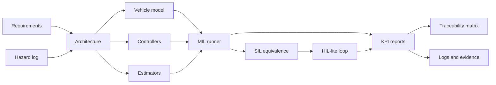

# Final Report

## Project Summary

This project implements a V-model-inspired validation pipeline for optimization-based control
algorithms. The primary case study is road-motion control using a CommonRoad-style scenario
manifest. The focus is not only controller performance, but the full engineering thread:

```text
Requirements -> design -> controller/estimator code -> MIL -> SIL -> HIL-lite
-> logs -> reports -> traceability
```

The project uses ISO 26262-inspired and Automotive-SPICE-inspired discipline, but it does not claim
compliance with those standards.

## Implemented Scope

| Area | Current implementation |
|---|---|
| Requirements | System/software requirements, hazard log, traceability matrix |
| Benchmark adapter | CommonRoad manifest loader, real XML loader, lanelet reference extraction, graceful fallback when XML files are missing |
| Vehicle model | Kinematic bicycle model with state/input definitions and constraints |
| Controllers | PID, LQR, linear MPC, CasADi NMPC, fallback braking |
| Estimators | Linear Kalman filter and EKF with residual metrics |
| Safety supervisor | Modes for normal, degraded, fallback brake, emergency stop, estimator fault, and solver timeout |
| MIL | Controller benchmark runner, KPIs, JSON/CSV/SVG/Markdown artifacts |
| SIL | Stable controller interface and back-to-back equivalence reports |
| HIL-lite | UDP-style protocol, controller server/client, deterministic timing loop, fault injection |
| CommonRoad checks | Lanelet membership, kinematic checks, optional CommonRoad-DC collision/boundary checks |
| Logging and CAN | Signal dictionary, CSV logs, JSON metadata, optional MF4 export, virtual CAN/DBC replay |

## Architecture



## Measured Phase 14 Results

Command:

```bash
python -m vcp.validation.run_mil \
  --suite configs/commonroad/scenario_suite.yaml \
  --controller all \
  --max-scenarios 0 \
  --steps 120 \
  --output-dir artifacts/phase14_mil_all
```

The repository does not commit raw CommonRoad XML scenarios, so the measured Phase 14 table below
used synthetic smoke references derived from the original smoke manifest. A separate seven-scenario
real XML suite is now defined in `configs/commonroad/real_scenario_suite.yaml` and can be fetched
locally with `scripts/fetch_commonroad_scenarios.py`. For real XML runs, the MIL runner extracts a
first-pass lanelet/goal reference path and supports CommonRoad-specific lanelet, kinematic,
collision, and boundary annotations when optional CommonRoad-DC tooling is installed.

| Controller | Success rate | Collision count | Road-boundary violations | Mean lateral RMSE | Mean speed RMSE | Max p95 solve time | Fallback count |
|---|---:|---:|---:|---:|---:|---:|---:|
| PID | 0.80 | 0 | 0 | 0.3211 m | 0.9891 m/s | 0.02 ms | 0 |
| LQR | 0.80 | 0 | 0 | 0.3177 m | 0.9845 m/s | 0.01 ms | 0 |
| Linear MPC | 0.80 | 0 | 0 | 0.3027 m | 0.9623 m/s | 62.73 ms | 0 |
| NMPC | 1.00 | 0 | 0 | 0.2285 m | 0.9601 m/s | 2.66 ms | 0 |

Interpretation: the current NMPC controller is strongest on the smoke suite because it handles the
harder turn-like and lane-change references better than the baselines. Linear MPC improves tracking
over PID/LQR but pays more solver overhead through CVXPY/OSQP in this local implementation.

## Real CommonRoad Drivability Evidence

A seven-scenario real XML suite is defined in `configs/commonroad/real_scenario_suite.yaml`.
With `commonroad-io==2024.3` and `commonroad-drivability-checker==2025.4.0`, the MIL runner now
uses progress-based lanelet/goal references and activates CommonRoad-DC checks. The current full
seven-scenario run is summarized in
`docs/reports/commonroad_drivability_report.md`.

The result is intentionally not polished: 0 of 7 scenarios passed. The checks found real
road-boundary violations, collision flags, kinematic violations, and fallback activations. This is
useful because it exposes the next missing engineering layer: the controller now has better route
progress tracking, but it still needs dynamic-obstacle reasoning and obstacle-aware behavior.

## SIL Evidence

The current SIL stage validates the controller interface and back-to-back equivalence using Python
adapters. A Phase 14 linear-MPC equivalence run passed with:

| Metric | Value |
|---|---:|
| Sample count | 4 |
| Max acceleration error | 0.0 |
| Max steering error | 0.0 |
| Max predicted-state error | 0.0 |

Native compiled controller execution is not claimed yet. The compiled adapter is a placeholder for
future acados-generated C or another packaged controller artifact.

## HIL-Lite Evidence

The HIL-lite loop validates controller timing and communication behavior without claiming full
industrial HIL. A Phase 14 smoke run used dropped-request, invalid-measurement, and delayed-request
fault injection:

| Metric | Value |
|---|---:|
| Steps | 8 |
| Missed deadlines | 1 |
| Timeouts | 1 |
| Fallback activations | 2 |

This is useful evidence for interface and fallback behavior. It does not replace dSPACE,
Speedgoat, real ECU I/O, or calibrated CAN/XCP test benches.

## Virtual CAN Evidence

The project includes a dependency-light virtual CAN representation plus a DBC file for controller
status replay:

| Artifact | Purpose |
|---|---|
| `configs/hardware/vcp_controller.dbc` | Defines the `VCP_ControllerStatus` frame |
| `configs/hardware/virtual_can.yaml` | Documents virtual `vcan0` replay configuration |
| `scripts/replay_signal_log_to_virtual_can.py` | Converts CSV signal logs to JSONL CAN frames |
| `tests/unit/test_virtual_can.py` | Verifies deterministic frame encoding and optional DBC loading |

This is an interface and packaging step, not a claim of real in-vehicle CAN validation.

## Traceability

The digital thread is maintained through:

```text
Requirement ID -> software requirement -> design element -> test case -> evidence artifact
```

The main artifact is `docs/requirements/traceability_matrix.csv`. The unit test
`tests/unit/test_documentation_traceability.py` checks that every system requirement has a
verification test ID, stage, and evidence artifact.

## Limitations

- Full CommonRoad XML closed-loop benchmark evidence requires downloaded scenario files.
- CommonRoad-DC obstacle and boundary checking is optional and only runs when the external package is installed.
- NMPC currently uses a local CasADi/IPOPT path; acados code generation is future work.
- SIL is interface/back-to-back validation, not compiled generated-code validation yet.
- HIL-lite is local timing/protocol validation, not full real-time hardware HIL.
- The energy-management transfer case is intentionally out of scope until the primary case study is
  stronger.
