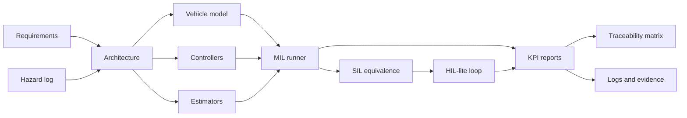

# Final Report

## Project Summary

This project implements a V-model-inspired validation pipeline for optimization-based control
algorithms. The primary case study is road-motion control using a CommonRoad-style scenario
manifest. The focus is not only controller performance, but the full engineering thread:

```text
Requirements -> design -> controller/estimator code -> MIL -> SIL -> HIL-lite
-> logs -> reports -> traceability
```

The project uses ISO 26262-inspired and Automotive-SPICE-inspired discipline, but it does not claim
compliance with those standards.

## Implemented Scope

| Area | Current implementation |
|---|---|
| Requirements | System/software requirements, hazard log, traceability matrix |
| Benchmark adapter | CommonRoad manifest loader and graceful fallback when XML files are missing |
| Vehicle model | Kinematic bicycle model with state/input definitions and constraints |
| Controllers | PID, LQR, linear MPC, CasADi NMPC, fallback braking |
| Estimators | Linear Kalman filter and EKF with residual metrics |
| Safety supervisor | Modes for normal, degraded, fallback brake, emergency stop, estimator fault, and solver timeout |
| MIL | Controller benchmark runner, KPIs, JSON/CSV/SVG/Markdown artifacts |
| SIL | Stable controller interface and back-to-back equivalence reports |
| HIL-lite | UDP-style protocol, controller server/client, deterministic timing loop, fault injection |
| Logging | Signal dictionary, CSV signal logs, JSON metadata, optional MF4 export hook |

## Architecture



## Measured Phase 14 Results

Command:

```bash
python -m vcp.validation.run_mil \
  --suite configs/commonroad/scenario_suite.yaml \
  --controller all \
  --max-scenarios 0 \
  --steps 120 \
  --output-dir artifacts/phase14_mil_all
```

The current repository does not include raw CommonRoad XML scenarios, so these are synthetic smoke
references derived from the scenario manifest. They are useful for controller regression and
portfolio demonstration, but they are not full CommonRoad benchmark results.

| Controller | Success rate | Collision count | Road-boundary violations | Mean lateral RMSE | Mean speed RMSE | Max p95 solve time | Fallback count |
|---|---:|---:|---:|---:|---:|---:|---:|
| PID | 0.80 | 0 | 0 | 0.3211 m | 0.9891 m/s | 0.02 ms | 0 |
| LQR | 0.80 | 0 | 0 | 0.3177 m | 0.9845 m/s | 0.01 ms | 0 |
| Linear MPC | 0.80 | 0 | 0 | 0.3027 m | 0.9623 m/s | 62.73 ms | 0 |
| NMPC | 1.00 | 0 | 0 | 0.2285 m | 0.9601 m/s | 2.66 ms | 0 |

Interpretation: the current NMPC controller is strongest on the smoke suite because it handles the
harder turn-like and lane-change references better than the baselines. Linear MPC improves tracking
over PID/LQR but pays more solver overhead through CVXPY/OSQP in this local implementation.

## SIL Evidence

The current SIL stage validates the controller interface and back-to-back equivalence using Python
adapters. A Phase 14 linear-MPC equivalence run passed with:

| Metric | Value |
|---|---:|
| Sample count | 4 |
| Max acceleration error | 0.0 |
| Max steering error | 0.0 |
| Max predicted-state error | 0.0 |

Native compiled controller execution is not claimed yet. The compiled adapter is a placeholder for
future acados-generated C or another packaged controller artifact.

## HIL-Lite Evidence

The HIL-lite loop validates controller timing and communication behavior without claiming full
industrial HIL. A Phase 14 smoke run used dropped-request, invalid-measurement, and delayed-request
fault injection:

| Metric | Value |
|---|---:|
| Steps | 8 |
| Missed deadlines | 1 |
| Timeouts | 1 |
| Fallback activations | 2 |

This is useful evidence for interface and fallback behavior. It does not replace dSPACE,
Speedgoat, real ECU I/O, or calibrated CAN/XCP test benches.

## Traceability

The digital thread is maintained through:

```text
Requirement ID -> software requirement -> design element -> test case -> evidence artifact
```

The main artifact is `docs/requirements/traceability_matrix.csv`. The unit test
`tests/unit/test_documentation_traceability.py` checks that every system requirement has a
verification test ID, stage, and evidence artifact.

## Limitations

- Full CommonRoad XML closed-loop validation is not complete in this repository snapshot.
- Obstacle collision checking is not yet connected to the CommonRoad drivability checker.
- NMPC currently uses a local CasADi/IPOPT path; acados code generation is future work.
- SIL is interface/back-to-back validation, not compiled generated-code validation yet.
- HIL-lite is local timing/protocol validation, not full real-time hardware HIL.
- The energy-management transfer case is intentionally out of scope until the primary case study is
  stronger.

## CV-Ready Summary

Built a V-model-inspired validation pipeline for optimization-based control algorithms with
requirements traceability, PID/LQR/Kalman baselines, MPC/NMPC controllers, MIL benchmarking,
SIL-style equivalence tests, HIL-lite timing validation, industrial-style signal logging, and
portfolio-grade reports.
